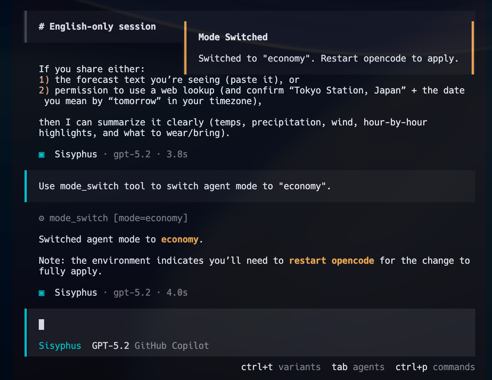

# opencode-agent-modes

[](https://www.npmjs.com/package/opencode-agent-modes)
[](https://www.npmjs.com/package/opencode-agent-modes)
[](https://www.npmjs.com/package/opencode-agent-modes)


OpenCode plugin to switch agent models between performance and economy modes.

> [!NOTE]
> **Primary Use Case**: When approaching your token limit, switch to
> pre-defined economy models to extend your session until your quota resets.
> Changes take effect after restarting opencode.

<p align="center">
  
</p>

## Star this repo to keep me motivated ⭐

I build this in my spare time. Every star shows that my work is valued and keeps me going!


## Features

- Switch between different model presets (performance, economy, or custom)
- Configurable presets with user-defined models
- Toast notifications for mode changes

### Supported Agents

| Agent Type            | Description                                                                                     |
| --------------------- | ----------------------------------------------------------------------------------------------- |
| opencode agents       | Standard agents (`build`, `plan`, etc.)                                                         |
| oh-my-opencode agents | Optional - applies if [oh-my-opencode](https://github.com/pekepeke/oh-my-opencode) is installed |

## Installation

Add the plugin to your `opencode.json`:

```json
{
  "plugin": ["opencode-agent-modes@latest"]
}
```

The following command files are automatically copied to
`~/.config/opencode/command/` when the plugin initializes:

- `mode-performance.md`
- `mode-economy.md`
- `mode-status.md`
- `mode-list.md`

## Usage

### Available Commands

- `/mode-performance` - Switch to high-performance models
- `/mode-economy` - Switch to cost-efficient free models
- `/mode-status` - Show current mode and configuration
- `/mode-list` - List all available mode presets

### Available Tools

- `mode_switch` - Switch to a specified mode preset
- `mode_status` - Display current mode settings
- `mode_list` - List all available presets

## Configuration

The plugin configuration is stored at `~/.config/opencode/agent-mode-switcher.json`.

On first run, the plugin automatically generates this file by:

1. Reading current models from `opencode.json` for the "performance" preset
2. Setting `opencode/glm-4.7-free` for the "economy" preset

### Example Configuration

> [!TIP]
> The `oh-my-opencode` section is optional. Omit it if you don't use oh-my-opencode.

```json
{
  "currentMode": "performance",
  "showToastOnStartup": true,
  "presets": {
    "performance": {
      "description": "High-performance models for complex tasks",
      "opencode": {
        "build": { "model": "github-copilot/gpt-5.2" },
        "plan": { "model": "github-copilot/gpt-5.2" }
      },
      "oh-my-opencode": {
        "Sisyphus": { "model": "anthropic/claude-opus-4-5-20251101" }
      }
    },
    "economy": {
      "description": "Cost-efficient free model for routine tasks",
      "opencode": {
        "build": { "model": "opencode/glm-4.7-free" }
      },
      "oh-my-opencode": {
        "Sisyphus": { "model": "opencode/glm-4.7-free" }
      }
    }
  }
}
```

### Model Priority

When both global `model` and agent-specific `opencode` settings are configured,
the priority is:

```text
agent.<name>.model > model (global)
```

Agent-specific settings override the global model setting.

## Custom Presets

To add a custom preset (e.g., "premium"):

1. Add the preset to `~/.config/opencode/agent-mode-switcher.json`:

   ```json
   {
     "presets": {
       "premium": {
         "description": "High-end models for critical tasks",
         "opencode": {
           "build": { "model": "anthropic/claude-opus-4-5-20251101" }
         }
       }
     }
   }
   ```

2. Create a command file at `~/.config/opencode/command/mode-premium.md`:

   ```md
   ---
   description: "Switch to premium mode (high-end models)"
   ---

   Use mode_switch tool to switch agent mode to "premium".
   ```

3. Restart opencode to apply changes.

> [!INFO]
> - Changes require an opencode restart to take effect
> - Custom mode presets can be added by editing the configuration file
> - Built-in command files (`mode-performance.md`, `mode-economy.md`, etc.)
>   are overwritten on every plugin startup. Do not modify them directly.
> - Custom command files (e.g., `mode-premium.md`) are not affected by
>   this overwrite and will persist across restarts.

## Development

This project uses [Bun](https://bun.sh/) as the runtime and package manager.

### Prerequisites

- [Bun](https://bun.sh/) v1.0 or later

### Setup

```bash
# Clone the repository
git clone https://github.com/j4rviscmd/opencode-agent-modes.git
cd opencode-agent-modes

# Install dependencies
bun install

# Run tests
bun test

# Type check
bun run typecheck

# Lint & format
bun run lint
bun run format

# Build
bun run build
```
